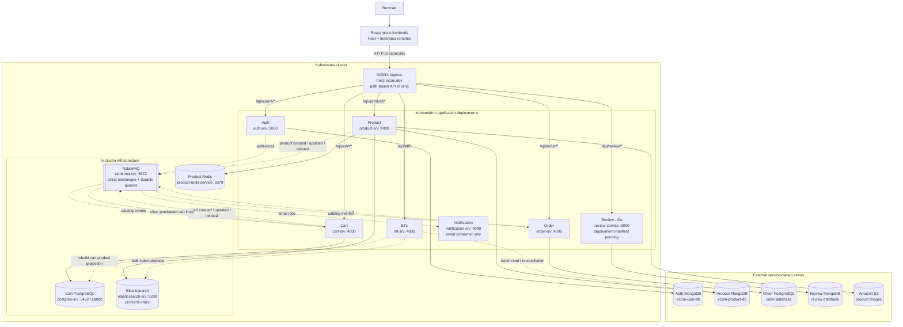
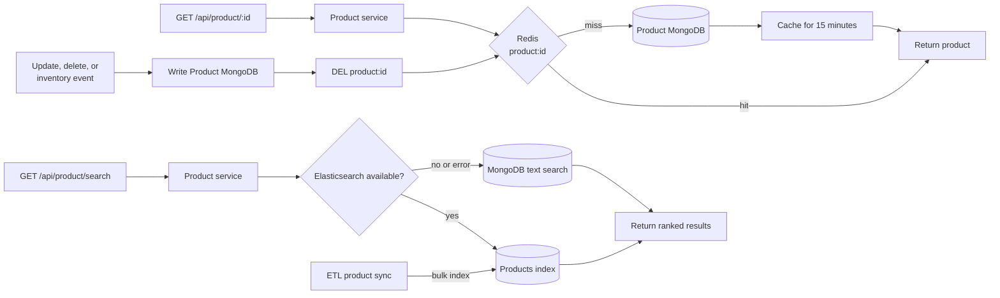

<h1 align="center">Cloud-Native E-Commerce Platform</h1>

<p align="center"><strong>A distributed commerce system built with independently deployable services, asynchronous messaging, polyglot persistence, and a federated frontend.</strong></p>

<table align="center">
  <tr>
    <td align="center" width="96"><br><sub><b>TypeScript</b></sub></td>
    <td align="center" width="96"><br><sub><b>Node.js</b></sub></td>
    <td align="center" width="96"><br><sub><b>Express</b></sub></td>
    <td align="center" width="96"><br><sub><b>Go</b></sub></td>
    <td align="center" width="96"><br><sub><b>React</b></sub></td>
  </tr>
  <tr>
    <td align="center" width="96"><br><sub><b>Material UI</b></sub></td>
    <td align="center" width="96"><br><sub><b>Redux</b></sub></td>
    <td align="center" width="96"><br><sub><b>MongoDB</b></sub></td>
    <td align="center" width="96"><br><sub><b>PostgreSQL</b></sub></td>
    <td align="center" width="96"><br><sub><b>Redis</b></sub></td>
  </tr>
  <tr>
    <td align="center" width="96"><br><sub><b>RabbitMQ</b></sub></td>
    <td align="center" width="96"><br><sub><b>AWS</b></sub></td>
    <td align="center" width="96"><br><sub><b>Docker</b></sub></td>
    <td align="center" width="96"><br><sub><b>Kubernetes</b></sub></td>
    <td align="center" width="96"><br><sub><b>GitHub Actions</b></sub></td>
  </tr>
</table>

## Overview

This repository implements an e-commerce platform as a collection of focused backend services and React micro-frontends. Each domain owns its API and persistence concerns, while RabbitMQ events keep dependent services synchronized without turning every operation into a chain of synchronous calls.

The project covers the engineering concerns that appear once a system moves beyond a single application: service boundaries, authentication and authorization, event contracts, local data projections, search and caching, payment integration boundaries, containerization, and Kubernetes-based development.

## Architecture

### System topology



Solid arrows represent synchronous request or data-access paths. Dotted arrows represent asynchronous events or maintenance synchronization.

Each service owns a logical database even when databases share the same underlying MongoDB or PostgreSQL infrastructure. Auth cannot query Product data directly, and Product does not query Cart or Order data. ETL is the explicit exception: it performs controlled batch synchronization and search-index rebuilding.

### How ingress routes requests

The NGINX Ingress manifest provides a shared, path-based backend entry point. It reads the request path and forwards traffic to an internal Kubernetes `Service`; that service then selects the matching deployment pod.

| Public path      | Kubernetes service    | Deployment           | Purpose                              |
| ---------------- | --------------------- | -------------------- | ------------------------------------ |
| `/api/users/*`   | `auth-srv:3000`       | `auth-deployment`    | Identity and access                  |
| `/api/product/*` | `product-srv:4000`    | `product-deployment` | Catalog, product details, and search |
| `/api/cart/*`    | `cart-srv:4000`       | `cart-deployment`    | Shopping carts                       |
| `/api/order/*`   | `order-srv:4000`      | `order-deployment`   | Orders and payment integration       |
| `/api/etl/*`     | `etl-srv:4000`        | `etl-deployment`     | Administrative synchronization       |
| `/api/review/*`  | `review-service:3000` | Manifest pending     | Reviews                              |

Notification is intentionally absent from the ingress table because it consumes RabbitMQ messages and does not expose a user-facing API.

### Where RabbitMQ fits

RabbitMQ is not used for incoming API requests. It carries changes that another service needs after the originating service has completed its own work.

| Publisher | Event                                                   | In-repository consumer | Effect                                               |
| --------- | ------------------------------------------------------- | ---------------------- | ---------------------------------------------------- |
| Product   | `product-created`, `product-updated`, `product-deleted` | Cart and Order         | Update their local product projections               |
| Order     | `order-created`                                         | Cart                   | Remove only the purchased items from the user's cart |
| Auth      | `auth-email`                                            | Notification           | Deliver password-related email                       |

This lets Cart and Order price or validate items from local PostgreSQL projections instead of making a synchronous Product API call during every request. The shared `common` package defines the event types, routing keys, publishers, listeners, authentication middleware, and error contracts used by the TypeScript services.

### Product cache and search flow



Redis currently accelerates product-detail reads; it is not presented as a universal cache for every endpoint. A cache miss loads the product from MongoDB and stores it with a 15-minute TTL. Product updates, deletes, and inventory changes remove the corresponding key so the next read is refreshed. Full-text search uses Elasticsearch when available and falls back to MongoDB if the search cluster is unavailable.

## Service map

| Component          | Responsibility                                                                             | Main technologies                                       |
| ------------------ | ------------------------------------------------------------------------------------------ | ------------------------------------------------------- |
| **Auth**           | Registration, login, JWT sessions, role-based access, password recovery                    | Node.js, TypeScript, Express, MongoDB                   |
| **Product**        | Catalog management, filtering, full-text search, image upload, cache management            | Node.js, TypeScript, MongoDB, Redis, Elasticsearch, S3  |
| **Cart**           | Per-user carts and a locally synchronized product projection                               | Node.js, TypeScript, PostgreSQL, TypeORM                |
| **Order**          | Order lifecycle and product projection, with Stripe payment and webhook integration points | Node.js, TypeScript, PostgreSQL, Drizzle ORM, Stripe    |
| **Notification**   | Event-driven email delivery                                                                | Node.js, TypeScript, RabbitMQ, Nodemailer               |
| **ETL**            | Synchronization between operational stores and search-oriented data                        | Node.js, TypeScript, MongoDB, PostgreSQL, Elasticsearch |
| **Review**         | Review and user-related HTTP APIs                                                          | Go, Gin, MongoDB                                        |
| **MFE client**     | Host shell plus user, dashboard, admin, and shared frontend modules                        | React, TypeScript, Rspack Module Federation, Turborepo  |
| **Common package** | Shared middleware, errors, message types, publishers, and listeners                        | TypeScript, Express, RabbitMQ                           |

## What the implementation demonstrates

- **Domain-oriented service boundaries** with separate deployable units and service-owned data.
- **Event-driven workflows** for product, inventory, cart, order, and notification changes.
- **Local read models** in Cart and Order, updated from product events to reduce synchronous service dependencies.
- **Search and caching** through Elasticsearch-backed product search and Redis-backed product caching with invalidation on writes.
- **Authentication and authorization** through JWT-based sessions, reusable middleware, and role-restricted routes.
- **Payment integration boundaries** for Stripe payment intents, raw webhook payloads, and order payment state; provider calls and signature verification are currently scaffolded.
- **Micro-frontend composition** with independently built React applications exposed through Module Federation.
- **Platform tooling** with Docker images, Kubernetes manifests, NGINX ingress, centralized configuration, secrets, persistent volumes, and Skaffold profiles.
- **Automated verification** with Jest, Supertest, frontend lint/type checks, and path-scoped GitHub Actions workflows.

## Repository structure

```text
.
├── auth/              # Identity and access service
├── product/           # Catalog, search, cache, and inventory service
├── cart/              # Shopping cart service
├── order/             # Order service and payment integration points
├── notification/      # Asynchronous email service
├── etl-service/       # Cross-store synchronization
├── review/            # Go review service
├── common/            # Shared contracts and backend building blocks
├── mfe-client/        # React micro-frontend workspace
├── k8s/               # Kubernetes workloads and infrastructure
├── skaffold/          # Focused Skaffold configurations
├── scripts/           # Setup, development, and build utilities
└── sandbox/           # Isolated technical experiments and examples
```

## Running the project

### Prerequisites

- Node.js 20+
- pnpm
- Go 1.22+
- Docker
- A local Kubernetes cluster
- `kubectl`, Skaffold, and an NGINX ingress controller

### 1. Install dependencies

Install every Node.js workspace and the Go service from the repository root:

```bash
./scripts/install-all.sh
```

Use `./scripts/install-all.sh --help` to install only selected services or run a frozen-lockfile install.

### 2. Configure Kubernetes secrets

Copy the committed template and replace its placeholders:

```bash
cp k8s/secret/ecom-secret.example.yml k8s/secret/ecom-secret.yml
kubectl apply -f k8s/secret/ecom-secret.yml
```

The generated secret file is ignored by Git. A root `.env` can also be converted into the same Kubernetes secret with:

```bash
./scripts/create-secret.sh ecom
```

See [k8s/README.md](k8s/README.md) for the configuration model and required keys.

### 3. Start the backend

```bash
# Auth, Product, and Cart with their infrastructure
skaffold dev

# All TypeScript backend services
skaffold dev -p backend

# Backend plus the complete infrastructure manifests
skaffold dev -p full
```

For focused Order service development:

```bash
skaffold dev -f skaffold/order.yaml
```

### 4. Start the frontend

In a separate terminal:

```bash
cd mfe-client
pnpm install
pnpm dev
```

The host application runs on `http://localhost:3000`; its remote modules run independently on ports `3001` through `3004`.

### Infrastructure-only development

MongoDB, Redis, and RabbitMQ can be started without the application services:

```bash
docker compose -f docker-compose.dev.yml up -d
```

This mode is useful when running an individual service directly from its own directory.

## Development commands

Each Node.js service owns its dependencies and scripts. Typical commands are:

```bash
cd auth
pnpm start       # development server
pnpm test        # service tests
pnpm build       # compile TypeScript
```

The frontend workspace provides repository-wide commands:

```bash
cd mfe-client
pnpm lint
pnpm type-check
pnpm build
```

## Scope

This is an actively developed distributed system. The repository presents implemented architecture and code—not unverified claims about traffic, latency, availability, or production scale. Performance and reliability figures belong here only when they are backed by reproducible tests and published results.

## Author

**Sourav Majumdar** · [LinkedIn](https://www.linkedin.com/in/majumdarsourav/) · [GitHub](https://github.com/souravdev-eng)
