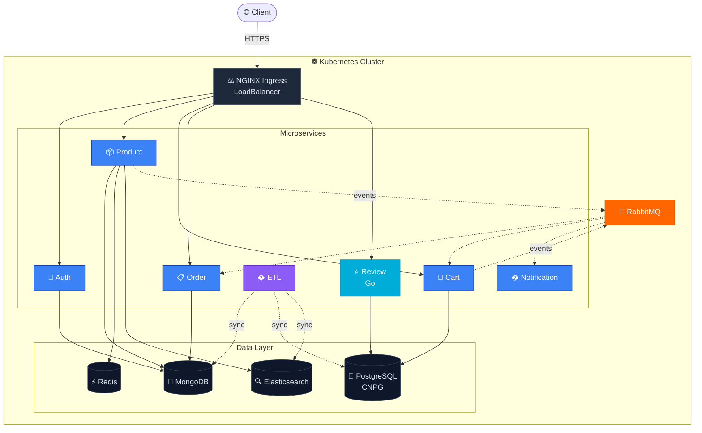
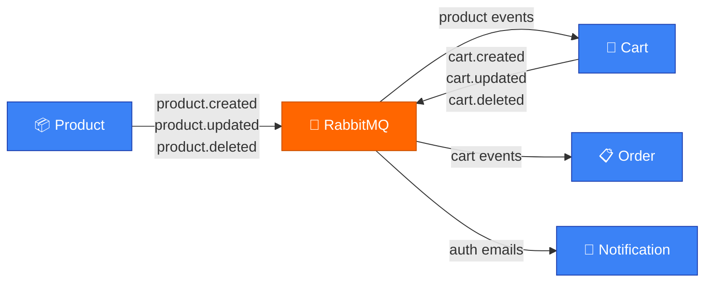

<a name="readme-top"></a>

[![LinkedIn][linkedin-shield]][linkedin-url]

<div align="center">
  <a href="https://github.com/souravdev-eng/cloud-native-ecom-micro-service">
    
  </a>
  <h2>Cloud-Native E-Commerce Microservices Platform</h2>
  <p>
    A full-stack e-commerce platform built with <strong>7 microservices</strong>, event-driven architecture,<br/>
    Elasticsearch-powered search, and Kubernetes orchestration.
  </p>

  
  
  
  
  
  
</div>

---

## What is this?

An **end-to-end e-commerce system** that runs as independent microservices on Kubernetes. Each service owns its data, communicates via RabbitMQ events, and can be deployed/scaled independently. The frontend is a micro-frontend (Module Federation) with separate apps for dashboard, user, and admin.

**Key highlights:**

- **Natural language search** — "Book under 500" parses into full-text search + price filter automatically
- **Elasticsearch + MongoDB dual search** — ES for speed, MongoDB as automatic fallback
- **Autocomplete suggestions** — Debounced edge-ngram suggestions as you type
- **ETL pipeline** — Syncs data across services (MongoDB → PostgreSQL, MongoDB → Elasticsearch)
- **CNPG read replicas** — PostgreSQL read/write splitting for cart service
- **Event-driven** — Product changes propagate to cart, orders, and notifications via RabbitMQ

---

## Architecture

### System Overview



### Event Flow (RabbitMQ)



| Service | Stack | Database | Messaging | Purpose |
| --- | --- | --- | --- | --- |
| **Auth** | Node.js / TS | MongoDB | — | JWT auth, RBAC, password reset |
| **Product** | Node.js / TS | MongoDB + Redis + ES | RabbitMQ | Catalog, search, caching, autocomplete |
| **Cart** | Node.js / TS | PostgreSQL (CNPG) | RabbitMQ | Cart management, inventory sync |
| **Order** | Node.js / TS | MongoDB | RabbitMQ | Order processing, payment (Stripe) |
| **Notification** | Node.js / TS | — | RabbitMQ | Email/SMS alerts |
| **ETL** | Node.js / TS | All DBs | — | Cross-service data sync pipelines |
| **Review** | Go / Gin | PostgreSQL | — | Product reviews (high-perf) |

---

## Frontend (Micro-Frontend)

Five apps composed via **Module Federation** at runtime:

| App         | Role                                            |
| ----------- | ----------------------------------------------- |
| `host`      | Shell — composes all remotes                    |
| `dashboard` | Product browsing, search, filters, autocomplete |
| `user`      | Auth, cart, checkout, profile                   |
| `admin`     | Seller dashboard, product management            |
| `shared`    | Common components, hooks, utilities             |

**Stack:** React 19, TypeScript, Rspack, MUI, Zustand, React Query, React Router, pnpm workspaces

---

## Search & Autocomplete

The search system supports **natural language queries** out of the box:

```bash
# Natural language queries — parsed automatically
GET /api/product/search?q=Book under 500
#  → searchText: "Book", priceMax: 500

GET /api/product/search?q=laptop between 200 and 800
#  → searchText: "laptop", priceMin: 200, priceMax: 800

GET /api/product/search?q=cheap headphones rated above 4
#  → searchText: "headphones", priceMax: 500, minRating: 4, sort: price asc

# Autocomplete (debounced, fires per keystroke)
GET /api/product/search/suggest?q=lap
#  → [{ title: "Laptop Pro 15", price: 999, highlight: "<em>Lap</em>top Pro 15" }, ...]
```

**How it works:** Query → NL parser extracts filters → Elasticsearch `title.autocomplete` (edge-ngram) + `match_phrase_prefix` → Falls back to MongoDB if ES is down.

---

## Project Structure

```
cloud-native-ecom-micro-service/
├── auth/                  # Auth microservice
├── product/               # Product microservice (+ ES search)
├── cart/                  # Cart microservice (PostgreSQL)
├── order/                 # Order microservice
├── notification/          # Notification microservice
├── etl-service/           # ETL pipelines (sync across services)
├── review/                # Review microservice (Go)
├── common/                # Shared npm package (@ecom-micro/common)
├── mfe-client/            # Micro-frontend monorepo
│   ├── host/              #   Shell app
│   ├── dashboard/         #   Product browsing & search
│   ├── user/              #   Auth & checkout flows
│   ├── admin/             #   Seller dashboard
│   └── shared/            #   Shared components
├── k8s/                   # Kubernetes manifests
│   ├── config/            #   ConfigMaps (ES index config, etc.)
│   ├── volumes/           #   PV/PVC definitions
│   └── cnpg/              #   CloudNativePG cluster
├── scripts/               # Docker build, cleanup, CNPG setup
├── skaffold.yaml          # Dev profiles (minimal/backend/full)
└── docker-compose.dev.yml # Local development alternative
```

---

## Quick Start

### Prerequisites

- Docker Desktop with Kubernetes enabled
- Node.js 18+, pnpm, Go 1.21+
- `skaffold` CLI

### Run locally with Skaffold

```bash
# Minimal profile (Auth + Product + Cart + ES + Redis + PG + RabbitMQ)
skaffold dev -p minimal

# Backend only (all services, no frontend)
skaffold dev -p backend

# Full stack (all services + frontend)
skaffold dev -p full
```

### Run frontend separately

```bash
cd mfe-client
pnpm install
pnpm dev          # starts all MFE apps in parallel
```

### Seed Elasticsearch index

```bash
# After services are running, sync products to ES:
curl -X POST -b <auth-cookie> http://localhost:4100/api/etl/sync/elasticsearch
```

---

## Infrastructure

| Component        | Technology                  | Role                                    |
| ---------------- | --------------------------- | --------------------------------------- |
| Orchestration    | Kubernetes (Docker Desktop) | Service deployment & scaling            |
| Ingress          | NGINX Ingress Controller    | API gateway, routing, SSL               |
| Messaging        | RabbitMQ                    | Event-driven service communication      |
| Caching          | Redis                       | Product listing cache (TTL-based)       |
| Search           | Elasticsearch 8.11          | Full-text search, autocomplete          |
| SQL DB           | PostgreSQL (CNPG)           | Cart & review data, read replicas       |
| NoSQL DB         | MongoDB                     | Auth, product, order, notification data |
| CI/CD            | GitHub Actions              | Build, test, deploy pipeline            |
| Containerization | Docker                      | Service images                          |

---

## Key Engineering Patterns

- **Cursor-based pagination** — Consistent results for large datasets, no offset skew
- **Multi-layer caching** — Redis with MD5 cache keys, TTL by query type
- **Lazy ES reconnect** — Product service recovers if ES starts late
- **ES → MongoDB fallback** — Search always works even if ES index is missing
- **ETL batch sync** — Bulk indexing with progress tracking and error collection
- **CNPG read/write split** — Writes go to primary, reads go to replicas

---

## Security

- JWT authentication with role-based access control (admin/seller/user)
- Cookie-based sessions with `httpOnly` + `secure` flags
- Input validation via `express-validator`
- CORS whitelisting per service
- TypeScript strict mode across all services

---

## Testing

- **Jest** + **Supertest** for backend integration tests
- **React Testing Library** for frontend component tests
- **mongodb-memory-server** for isolated DB tests
- Run: `npm test` in any service directory

---

## Scripts

```bash
./scripts/docker-build-push.sh              # Build & push all service images
./scripts/docker-build-push.sh product auth  # Build specific services
./scripts/docker-cleanup.sh                  # Reclaim Docker disk space
./scripts/setup-cnpg.sh                      # Install CNPG operator for PG replicas
```

---

## Tech Stack

<div align="center" style="display:flex; flex-wrap:wrap; justify-content:center; gap:25px; max-width:70%; margin:auto;">
  
  
  
  
  
  
  
  
  
  
  
  
  
  
  
  
</div>

---

## Contact

**Sourav Majumdar** — [LinkedIn](https://www.linkedin.com/in/majumdarsourav/) — souravmajumdar.dev@gmail.com

[linkedin-shield]: https://img.shields.io/badge/-LinkedIn-black.svg?style=for-the-badge&logo=linkedin&colorB=555
[linkedin-url]: https://www.linkedin.com/in/majumdarsourav/
