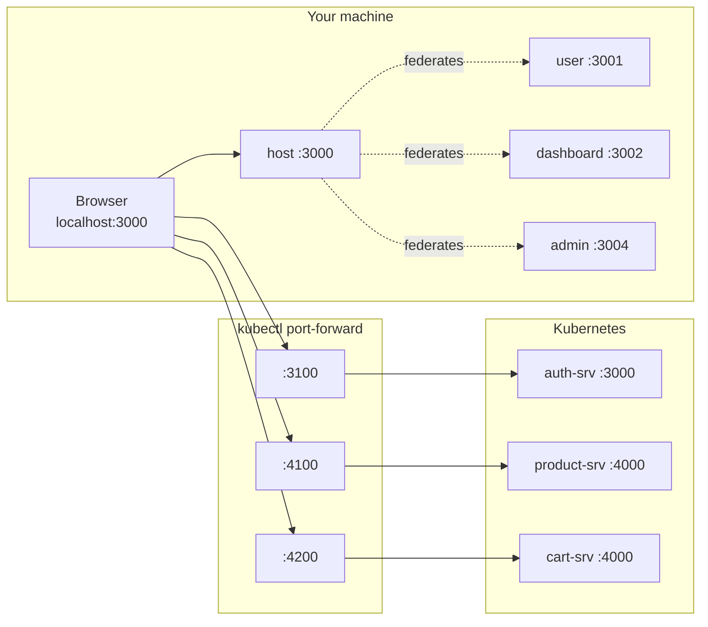

# MFE Local Dev & Config Strategy

> Why `mfe-client/dev.config.json` + `scripts/dev.mjs` exist, what problem they
> actually solve, and how the same design survives contact with production —
> where the config is nothing like it is on your laptop.

## TL;DR

The MFEs run **outside** the cluster while the APIs run **inside** it. That one
structural fact is the source of every config headache in this directory. The fix
is two files:

| File | Role |
| --- | --- |
| `mfe-client/dev.config.json` | **Data.** Every port, every service mapping, the prod ingress host. Declarative, no logic. |
| `mfe-client/scripts/dev.mjs` | **Behaviour.** One command that reads that data and makes the environment real. |

Everything else — five rspack configs, five API client modules, the host's
federation config — *derives* from the first file instead of restating it. The
production story is then a **data** change, not a code change. Mostly. Section 8
is honest about where that claim currently breaks.

---

## 1. The structural problem

Module Federation needs each MFE to be served by a real dev server with HMR. You
*could* containerise them and run them in k8s, but then every keystroke costs an
image rebuild — which throws away the entire reason to use a dev server. So the
MFEs stay on the host machine.

The backends, meanwhile, live in the cluster (that's the point of the repo). So
the browser sits on one side of the cluster boundary and every API it calls sits
on the other:



Two consequences that drive the whole design:

1. **Something has to bridge the boundary.** That's `kubectl port-forward`, and
   it is *stateful infrastructure your dev environment depends on* — it can drop,
   it takes time to become ready, and it must be cleaned up.
2. **The browser needs absolute URLs.** A static bundle has no server-side env to
   read at request time. The URLs have to get *into* the bundle somehow.

Neither of these exists when you build a normal monolithic SPA. Both are
permanent features of an MFE-on-k8s setup, so they deserve a deliberate design
rather than a pile of hardcoded strings.

## 2. What it looked like before

The information "the cart API is on port 4200" was written down in **five**
independent places. "The user MFE serves on 3001" in **three**. Nothing
cross-checked them.

| Fact | Restated in |
| --- | --- |
| Backend API ports | `user/src/api/baseUrl.ts`, `dashboard/src/api/baseUrl.ts`, `admin/src/api/baseUrl.ts`, `shared/src/config/apiConfig.ts`, `dashboard/src/hooks/useAuth.tsx` |
| MFE dev ports | each `rspack.config.ts` (`devServer.port` **and** `output.publicPath`), plus `host/module-federation.config.ts` |
| Prod URLs | `host/module-federation.config.prod.ts` (said `ecom.local`, while the ingress said `ecom.dev`) |

Three things made this worse than ordinary duplication:

**The failure mode was silent.** Change a port in four of five places and nothing
fails to compile. You get a blank screen or `ERR_CONNECTION_REFUSED` in the
console, and you go debugging the wrong layer. Duplication that the compiler
catches is annoying; duplication that only the browser catches is expensive.

**The instructions were fiction.** Four source files carried the comment
`// Backend via port-forward (run: ./scripts/start-backend.sh)`. That script did
not exist. Everyone was expected to remember six `kubectl port-forward` incantations
and run them in six terminals — the actual knowledge lived in muscle memory, not
in the repo.

**Production was already broken and nobody could tell.** Prod bundles baked in
`localhost:3100` for API calls, and the prod federation config pointed at
`mfe-user.ecom.local` / `mfe-dashboard.ecom.local` while the only ingress host
was `ecom.dev`. It also omitted `admin` entirely, which the dev config included.
Because nothing deploys the MFEs yet, this rotted quietly.

The lesson worth taking from this: **the cost of scattered config isn't typing —
it's that no single place tells you the truth**, so drift is undetectable until
runtime.

## 3. The two ideas

### One config file, treated as data

`dev.config.json` declares apps and backends. No logic, no conditionals:

```json
{
  "apps":     [{ "name": "user", "port": 3001, "role": "remote" }],
  "backends": [{ "key": "CART", "service": "cart-srv",
                 "remotePort": 4000, "localPort": 4200, "required": true }]
}
```

`role` and `required` are load-bearing, not documentation:

- `role: "library" | "remote" | "shell"` determines **start order** (`shared`
  before remotes before the shell) and which apps the host federates. Adding a
  remote is one JSON entry — the host picks it up with no edit.
- `required: true|false` determines whether a missing service **stops the world**
  or just prints a note. `auth`/`product`/`cart` are required (the minimal
  skaffold profile deploys them); `order`/`etl`/`review` only exist in bigger
  profiles, so their absence is normal and must not be an error.

### One entry point, which owns the whole lifecycle

`scripts/dev.mjs` is the only thing you run. It does preflight → install →
tunnels → readiness → dev servers → teardown, and reports each stage. Crucially
it reads the *same* config the build reads, so the tunnel it opens on 4200 and the
URL compiled into the bundle cannot disagree.

### Derive, don't duplicate

`config/dev-config.cjs` is the small adapter both sides go through. It's CommonJS
on purpose: the rspack configs are TypeScript compiled by ts-node with
`module: CommonJS`, so they can `require()` it directly with no build step.

```
dev.config.json
      │
      ▼
config/dev-config.cjs ──────┬──────────────────────────────┐
                            ▼                              ▼
                    scripts/dev.mjs              <app>/rspack.config.ts
                    (which tunnels,              (devServer.port,
                     which apps, order)           publicPath,
                                                  __API_ENDPOINTS__)
```

The adapter is where *policy* lives — dev vs prod URL shape, env overrides,
validation. It fails loudly on a duplicate port claim, because two apps quietly
sharing a port is a genuinely confusing bug:

```
dev.config.json: port 3002 is claimed by both app "dashboard" and backend "X"
```

## 4. Why build-time injection — and what it costs

The URLs have to reach browser code somehow. Options considered:

| Approach | Verdict |
| --- | --- |
| `.env` per app | Still five files to keep in sync — the original problem with extra steps. |
| Runtime `window.__APP_CONFIG__` | **Correct for production** (see §8), but needs a server or container entrypoint to template it. Overkill for a dev-only setup. |
| `DefinePlugin` inlining a single object | **Chosen.** One source, zero runtime cost, works identically across all five apps. |

So every app gets `__API_ENDPOINTS__` inlined at build time and reads it the same
way:

```ts
declare const __API_ENDPOINTS__: Record<string, string>;
const { AUTH, PRODUCT, CART } = __API_ENDPOINTS__;
```

`src/` now contains **zero** hostnames and **zero** ports. That's the invariant
worth protecting: if you ever find yourself typing `localhost` into `src/`, the
setup has been defeated.

**The cost, stated plainly:** `DefinePlugin` bakes the URL into the artifact, so
there is *one build per environment*. That's fine for dev and it is the thing that
must change before this deploys anywhere real. §8 covers the migration, and the
design was chosen so that migration is additive rather than a rewrite.

## 5. Why `kubectl port-forward` — and what it costs

The alternative is `/etc/hosts` + the NGINX ingress, hitting `http://ecom.dev/api/*`
exactly like production does.

| | port-forward (chosen) | ingress + `/etc/hosts` |
| --- | --- | --- |
| Host setup | none | `sudo` edit to `/etc/hosts` |
| Needs ingress controller | no | yes |
| Works with `skaffold dev` (minimal) | yes | only if ingress is installed |
| Origins the browser sees | **many** (`:3100`, `:4100`, …) | **one** (`ecom.dev`) |
| Matches prod request path | no | yes |

Port-forward wins on bootstrap cost — nothing to install, no sudo, works the
moment a pod is running — and it was already the de-facto choice baked into the
code. But the row that matters is the second-to-last one, and it is a **real
cost, not a cosmetic one**:

In dev the browser talks to many origins, so every API call is cross-origin and
depends on CORS plus `withCredentials: true` cookies surviving a cross-site
request. In prod, everything is one origin behind the ingress and none of that
applies. **Cookie and CORS bugs can therefore exist in exactly one of the two
environments** — the classic "works locally, breaks in staging" (or the reverse).

This is a known, accepted gap, not an oversight. The mitigation is to add an
ingress mode (`--via=ingress`) so dev can optionally reproduce the prod
single-origin path; it's listed in §10. Until then, treat any auth/cookie change
as something that must be verified against the ingress path, not just locally.

## 6. The lifecycle engineering

A script that merely *launches* things isn't much better than a README. Three
details are what make it trustworthy, and each is a miniature version of a real
production concern.

**Started ≠ ready.** `kubectl port-forward` prints `Forwarding from 127.0.0.1:4200`
*before* it can actually serve traffic. Starting the dev servers on that signal
gives you a race where early API calls fail for no visible reason. The script
polls a real TCP connect on each port and only then proceeds — the same
distinction as a k8s liveness vs readiness probe.

**Tunnels drop, so they're supervised.** A pod restart kills its forward and the
app silently loses that API. Each forward is restarted with a cap (10 attempts),
and the give-up message names the likely cause:

```
! CART forward exited (1) — restarting (3/10)
✗ CART forward died 10× — giving up. Is cart-srv crash-looping?
```

**One Ctrl+C must actually mean it.** This one produced a genuine bug worth
remembering. The process tree is `dev.mjs → turbo → rspack (×N)`. Signalling the
direct child only kills `turbo`'s wrapper and **orphans every rspack server**,
leaving ports 3000–3004 held by processes with no parent. The fix is to give each
child its own process group and signal the group:

```js
spawn(cmd, args, { detached: true });   // new process group
process.kill(-child.pid, 'SIGTERM');    // negative pid = whole group
```

Verified: after Ctrl+C, zero stray processes and zero held ports.

**Fail fast, fail loud, name the fix.** Every error says what to do next
(`skaffold dev -p backend`, `kubectl config use-context …`). A second bug found
here: the original `fatal()` scheduled `process.exit` on a timer and *returned*,
so execution continued past a fatal error — which made a **required** missing
service print as "optional". Fatal paths must not be async.

## 7. What this buys day to day

| | Before | After |
| --- | --- | --- |
| Terminals | 1 skaffold + up to 6 port-forwards + 1 dev server | 1 skaffold + **1** |
| Commands to memorise | 7+ | `pnpm dev` |
| Files to edit to move a port | 2–5 | **1** |
| Cluster not running | cryptic axios errors in the browser | named error + the exact command to fix it |
| Tunnel drops mid-session | silent; you debug the app | logged + auto-restarted |
| Stale processes after Ctrl+C | common (`EADDRINUSE` next run) | none |
| Port already in use | crash | detected and reused |
| Onboarding a teammate | tribal knowledge | `pnpm dev`, `pnpm dev:help` |

Escape hatches exist so the abstraction doesn't become a cage —
`--only=`, `--no-forward`, `--forward-only`, `MFE_AUTH_URL=`, `MFE_API_HOST=`,
and `pnpm dev:turbo` for the raw underlying command.

## 8. Production: same idea, different data

This is the part the design was actually shaped around. The dev and prod
topologies are not variations on a theme — they're structurally different:

| | Dev | Production |
| --- | --- | --- |
| Origins | **N** (`localhost:3100`, `4100`, …) | **1** (`http://ecom.dev`) |
| Routing | one tunnel per service | ingress path-routes `/api/users`, `/api/cart`, … |
| Who resolves the address | `kubectl port-forward` | NGINX ingress + k8s DNS |
| Bundle `publicPath` | absolute dev-server URL | `auto` |
| CORS | required | not applicable (same origin) |

### What already transfers

Because app code only ever reads `__API_ENDPOINTS__[KEY]`, the *shape* change
(N hosts → 1 host + paths) is absorbed entirely by the loader:

```js
// config/dev-config.cjs
if (isProd(mode)) {
  for (const be of cfg.backends) out[be.key] = cfg.production.apiBaseUrl; // one host
} else {
  for (const be of cfg.backends) out[be.key] = `http://${host}:${be.localPort}`;
}
```

The app appends `/api/cart` either way; dev hits the cart pod directly, prod hits
the ingress which routes on that same path. **The same source code is correct in
both topologies** — which is exactly the property you want, and it fell out of
having one place that knows about URLs.

Two prod correctness bugs were fixed as a direct consequence of centralising:
prod bundles no longer contain `localhost` (verified: zero occurrences), and
`output.publicPath` is now `'auto'` in prod instead of a baked
`http://localhost:3001/`. `auto` makes a federated remote infer its origin from
the URL its own script was loaded from — a baked host is wrong the instant the
artifact is served from a different domain or path, and for a *remote* that means
the host app fails to load its chunks.

### What does NOT transfer yet

Three honest gaps. None is hidden in the code — each is called out in
`dev.config.json` or `CLAUDE.md`.

**(a) Build-per-environment.** `DefinePlugin` bakes URLs in, so a staging build
and a prod build are different artifacts. The industry norm is **build once,
deploy many** — you promote a tested artifact rather than rebuilding per
environment, because a rebuild is a new, untested thing.

The migration is additive. Keep the baked values as a *fallback*, add a runtime
override read at boot:

```html
<!-- index.html, templated by the container entrypoint at start -->
<script>window.__APP_CONFIG__ = { AUTH: "${AUTH_API_URL}", CART: "${CART_API_URL}" };</script>
```

```ts
// one shared accessor; app code is unchanged
const endpoints = { ...__API_ENDPOINTS__, ...(window.__APP_CONFIG__ ?? {}) };
```

With nginx serving the bundle, the entrypoint is a one-liner
(`envsubst < index.html.tmpl > index.html`), and the values come from the
existing single `ecom-config` ConfigMap — matching the convention every backend
service already follows. `dev.config.json` then still owns dev; the ConfigMap
owns prod; app code reads one merged object and doesn't care.

**(b) The cross-origin asymmetry from §5.** Prod is same-origin, dev is not.
Cookies (`withCredentials: true`) and CORS behave differently in each. Anything
touching auth should be verified against the ingress path before it's trusted.

**(c) MFE deployment doesn't exist.** There are no `k8s/mfe-*-depl.yml`
manifests and no skaffold profile deploys the MFEs. `production.remoteUrlPattern`
(`http://ecom.dev/mfe/{name}/remoteEntry.js`) is a **placeholder** — the matching
`/mfe/*` ingress routes are not defined in `k8s/ingress-depl.yml`. When that work
happens, two things need deciding that dev never forces you to think about:

- **Remote versioning.** In dev, host and remotes are always the same commit. In
  prod they deploy independently, so a host can load a remote built against a
  different contract. Options: pin remote URLs to a version/digest, or use
  Module Federation's `mf-manifest.json` for dynamic resolution. Either way it's
  a deliberate choice, and "latest" is the choice that bites.
- **Shared-dependency skew.** React is `singleton: true, eager: true`. Two
  independently deployed remotes with mismatched React versions fail at runtime,
  not build time.

### The environment matrix

| Concern | Dev today | Prod target | Status |
| --- | --- | --- | --- |
| API base URLs | `dev.config.json` → `DefinePlugin` | ConfigMap → runtime `window.__APP_CONFIG__` | design in §8(a), not built |
| Cluster access | `kubectl port-forward` | ingress | done for prod |
| `publicPath` | absolute dev-server URL | `auto` | **done** |
| Remote URLs | derived, `localhost:<port>` | `remoteUrlPattern` | pattern set, ingress routes missing |
| CORS/cookies | cross-origin | same-origin | known asymmetry, §5 |
| MFE deploy | n/a | manifests + CI | not started |

## 9. Invariants to preserve

If you change things in `mfe-client/`, keep these true — they're what the design
is actually made of:

1. **No hostname or port literals in any `src/`.** Read `__API_ENDPOINTS__`.
2. **No port literals in `rspack.config.ts`.** Use `devConfig.serve(name)`.
3. **A new port or service is a `dev.config.json` edit and nothing else.**
4. **New env-varying value → add it to the loader**, not to five call sites.
5. **`turbo --filter` takes package names** (`@mfe/host`), not directory names.
   `--filter=host` silently matches nothing — this is why `packageName()` reads
   the real name from each `package.json`.
6. **Fatal paths exit synchronously.**

## 10. Known gaps & follow-ups

Ordered by value:

1. **Runtime config for prod** — §8(a). Unblocks build-once-deploy-many.
2. **`--via=ingress` dev mode** — closes the CORS/cookie asymmetry by letting dev
   reproduce the prod single-origin path.
3. **MFE k8s manifests + `/mfe/*` ingress routes**, then revisit remote
   versioning — §8(c).
4. **No CI for the MFEs.** Workflows exist only for `auth`, `cart`, `product`.
   A `type-check` + `build` gate would have caught the broken prod URLs.
5. **Pre-existing type errors** block a green `turbo run type-check`:
   `shared/configs/sharedModules.ts` (dead code, nothing imports it),
   plus `admin/src/components/Sidebar/Sidebar.tsx`,
   `admin/src/hooks/useSignup.ts`, `dashboard/src/bootstrap.tsx`.
6. **ESLint doesn't run anywhere** in `mfe-client/` — ESLint 9 needs a flat
   config and none exists, so `pnpm lint` reports nothing in every workspace.
7. **`shared/module-federation.config.ts` has `name: 'sheared'`** (typo).
   Harmless while `shared` is a library, not federated — don't rely on the name.
8. **`doc/skaffold.md` documents `skaffold dev -p mfe`**, which does not exist.
   The profiles are `minimal`, `backend`, `full`.

## Appendix: file map

| Path | Purpose |
| --- | --- |
| `mfe-client/dev.config.json` | **Single source of truth.** Ports, service mappings, prod host. |
| `mfe-client/config/dev-config.cjs` | Loader + policy: validation, dev/prod URL shape, env overrides, `packageName()`. |
| `mfe-client/scripts/dev.mjs` | The one command. Preflight, tunnels, supervision, dev servers, teardown. |
| `mfe-client/scripts/start-dev.sh` | Deprecated shim → `dev.mjs`. |
| `mfe-client/<app>/rspack.config.ts` | Consumes `serve()` + `defineEntries()`. No literals. |
| `mfe-client/<app>/src/api/baseUrl.ts` | Reads `__API_ENDPOINTS__`. |
| `mfe-client/host/module-federation.config.ts` | Remotes derived from config; covers dev **and** prod (no `.prod.ts`). |
| `k8s/ingress-depl.yml` | Prod routing. Its `host:` must match `production.apiBaseUrl`. |
| `k8s/config/app-config.yml` | The single `ecom-config` ConfigMap — where prod MFE values belong in §8(a). |
