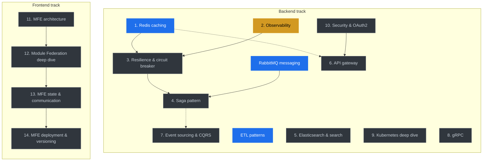

# Learning Roadmap

A planner — not a tutorial — for the distributed-systems and micro-frontend topics being studied through `sandbox/`. Each topic owns its own deep documentation; this file tracks status, sequencing, and where to find the real content.

The status table below is the single source of truth. Anything else that contradicts it is stale.

---

## Status

### Backend (microservices)

| # | Topic | Status | Priority | Sandbox |
| --- | --- | --- | --- | --- |
| 0a | RabbitMQ messaging | Done | — | `sandbox/rabbitmq-learning/` |
| 0b | ETL patterns | Done | — | `etl-service/docs/` (lives in the service, not sandbox) |
| 1 | Redis caching patterns | Done (docs); examples WIP | High | `sandbox/redis-learning/` |
| 2 | Distributed tracing & observability | In progress | High | `sandbox/observability-learning/` |
| 3 | Circuit breaker & resilience | Planned | High | — |
| 4 | Saga pattern (distributed transactions) | Planned | High | — |
| 5 | Elasticsearch & search patterns | Planned | Medium | — |
| 6 | API gateway patterns | Planned | Medium | — |
| 7 | Event sourcing & CQRS | Planned | Medium | — |
| 8 | gRPC & Protocol Buffers | Planned | Low | — |
| 9 | Kubernetes deep dive | Planned | Medium | — |
| 10 | Security & OAuth2 patterns | Planned | Medium | — |

### Frontend (micro-frontends)

| #   | Topic                                          | Status  | Priority | Sandbox |
| --- | ---------------------------------------------- | ------- | -------- | ------- |
| 11  | Micro-frontend architecture                    | Planned | High     | —       |
| 12  | Module Federation deep dive                    | Planned | High     | —       |
| 13  | MFE state management & cross-MFE communication | Planned | High     | —       |
| 14  | MFE deployment & versioning                    | Planned | Medium   | —       |

**Status values**: `Done` — content exists and is reviewed. `In progress` — content partially exists. `Planned` — directory does not exist yet; the topic description below is a stub.

**Priority** is relative to _immediate value to this codebase_, not intrinsic difficulty.

---

## Visual learning path

The two tracks can be progressed in parallel. Solid arrows are the recommended order; dashed arrows mark soft prerequisites that improve context but do not block.



Colour key: blue = done, amber = in progress, grey = planned.

---

## Topic notes

Short notes only — when a topic moves to `In progress` or `Done`, the deep content goes into its own sandbox directory's README and docs.

### 1. Redis caching patterns — done (docs)

Production reference covering data model, caching patterns, invalidation, distributed locks, rate limiting, sessions, sorted sets, and operational patterns (persistence, replication, cluster, capacity, observability, security).

- Content: `sandbox/redis-learning/docs/00-index.md`
- Examples directory exists with skeleton folders; most are still empty.
- The `product` service uses Redis today; recent work added a `RedisCache` wrapper at `product/src/cache/redisCache.ts` and invalidation on the write paths.

### 2. Distributed tracing & observability — in progress

Existing work under `sandbox/observability-learning/` (52 files at last check). Goal: end-to-end correlation IDs, structured logging, OTLP / Jaeger / Tempo for traces, Prometheus for metrics, dashboards, and an incident playbook.

The platform runs Elasticsearch and Kibana (see `kibana.yml`, `k8s/elasticsearch-depl.yml`); there is no Logstash deployment, so log aggregation is **EK**, not ELK. Filebeat or Fluent Bit would be the forwarder of choice if the L tier is added later.

### 3. Circuit breaker & resilience — planned

Patterns: timeouts, retries with jittered exponential backoff, circuit breaker (closed / open / half-open), bulkheads, fallbacks, graceful degradation. In Node, `opossum` is a reasonable starting library; the patterns are language-agnostic. Will tie into `order/` checkout calls (payment, inventory) and inter-service HTTP.

### 4. Saga pattern — planned

Choreography vs orchestration, compensating actions, idempotency keys (critical for Stripe in `order/`), and failure-mode tests. Real target: the checkout flow `order → payment → inventory → notification`. Saga state can live in Postgres or Redis; not a Redis prerequisite.

### 5. Elasticsearch & search patterns — planned

Mappings, analyzers, multi-match, autocomplete (edge n-grams or the `completion` suggester), faceted search via aggregations, relevance tuning. Target: `product/` search. Standalone of observability work.

### 6. API gateway patterns — planned

Routing, auth offload, rate limiting, request/response transformation, response aggregation, caching at the edge. Likely candidates: NGINX + Lua, Kong, Envoy. Worth deciding _before_ doing the security topic, since the gateway is where most cross-cutting auth concerns land.

### 7. Event sourcing & CQRS — planned (advanced)

Event store, aggregates, projections, snapshots, schema versioning. Most useful as a study topic — only adopt for a service if the audit-trail requirement justifies the operational cost. Likely target: order history, not the whole platform.

### 8. gRPC & Protocol Buffers — planned (low)

Schema-first contracts, unary/streaming RPCs, code generation. Honest framing on performance: binary serialisation and HTTP/2 multiplexing typically reduce latency and bandwidth versus JSON over HTTP/1.1, especially for small frequent calls and streaming workloads. Headline "Nx faster" numbers are workload-dependent and not a useful goal.

### 9. Kubernetes deep dive — planned

Pods, deployments, services, configmaps/secrets, persistent volumes, HPA, resource limits/requests, Helm, operators. The platform already deploys to k8s (`k8s/`), so this is depth, not initial setup.

### 10. Security & OAuth2 — planned

OAuth2 flows, JWT and refresh-token rotation (the Redis chapter 06 covers refresh-token reuse detection), RBAC/ABAC, API keys, mTLS for service-to-service, secrets management. Logically belongs **before** API gateway in scope, even though it is later in this list — auth concepts inform what the gateway does.

### 11. Micro-frontend architecture — planned

When MFE is justified (and when it is not), integration patterns (build-time, runtime, server-side composition), team/Conway-Law fit. The platform already runs Module Federation in `mfe-client/`; this topic is about validating and articulating the existing decisions, not greenfield design.

### 12. Module Federation deep dive — planned

Host/remote pattern, `remoteEntry.js`, shared scope, version negotiation, dynamic remotes, type sharing. Inspect the existing config:

```
mfe-client/host/module-federation.config.ts
mfe-client/{host,user,dashboard,admin,shared}/module-federation.config{.prod,}.ts
```

Open question to address in this topic: every MFE pins `react` and `react-dom` to `requiredVersion: '19.1.1'` exactly. With `singleton: true` this means a single mismatched patch across remotes fails at runtime. The deep-dive should cover whether to relax to a caret range and what the upgrade procedure looks like.

### 13. MFE state management & communication — planned

Patterns: shell-orchestrated props, custom DOM events, shared store in the host, URL-driven state, typed pub/sub. Concrete cross-cutting flows to design: auth/login, cart updates, logout-everywhere.

### 14. MFE deployment & versioning — planned

Independent CI per MFE, manifest-based versioning, blue/green and canary, rollback. The platform's MFE Dockerfiles use multi-stage with NGINX as the runtime; production federation config points at `mfe-*.ecom.local` hosts.

---

## How to use this roadmap

1. Pick a topic with status `Planned` and high priority.
2. Move it to `In progress` in the table.
3. Create `sandbox/<topic>-learning/` with at least:
   - `README.md` — scope, links, and current status.
   - `docs/` — chapters in the same reference style as `sandbox/redis-learning/docs/`.
   - `examples/` (optional) — runnable code; mark anything stubbed as such.
4. Cross-link from the topic note above to the new sandbox.
5. Move the table entry to `Done` only when the docs are reviewed _and_ any examples either work end-to-end or are explicitly marked as skeletons.

When a topic touches the actual platform (Redis already does, Saga and Resilience will), capture the design decision in a short ADR-style note inside the relevant service's `docs/` directory and link from the sandbox.

---

## Existing sandbox layout

For reference — what is on disk today:

```
sandbox/
  learning-roadmap/        this file
  rabbitmq-learning/       Done
  observability-learning/  In progress
  redis-learning/          Done (docs); examples skeleton
```

All other topics in the table have no `sandbox/` directory yet.

---

_Updated: April 25, 2026._ _Current focus: Observability (Topic 2)._
